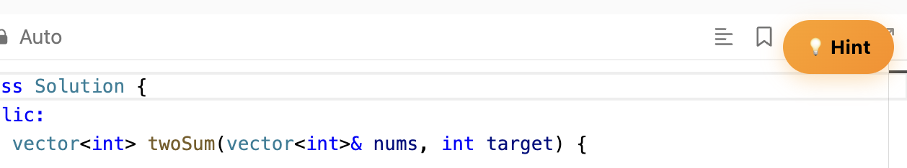
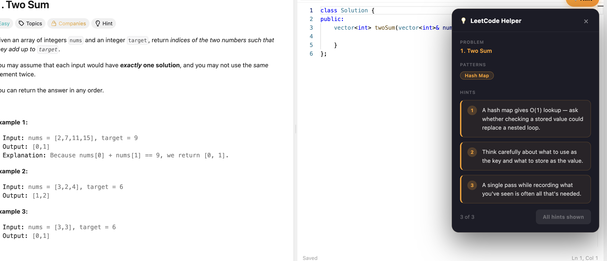

# LeetCode Helper Extension

A Chrome extension that adds progressive, non-spoiler hints to LeetCode problems.

## Why I built this
While practicing LeetCode, I often found that jumping to solutions too early hurt my learning. I built this tool to guide problem-solving without giving away the answer.

## Features
- Detects likely algorithmic patterns
- Shows progressive hints one at a time
- Works directly on LeetCode problem pages
- Supports common patterns like hash maps, sliding window, DFS/BFS, binary search, stacks, and intervals

## Tech
- JavaScript
- Chrome Extension Manifest V3
  
## How it works
- Extracts problem title and description from the page
- Matches keywords against known algorithmic patterns
- Ranks patterns based on relevance
- Displays hints progressively to guide thinking
  
## How to use
1. Download the repo
2. Open Chrome and go to `chrome://extensions`
3. Enable Developer mode
4. Click Load unpacked
5. Select the project folder

## Screenshots

### Button

### Hint Panel

## Limitations
- Pattern detection is heuristic-based and may not always be accurate
- Currently supports common patterns only
- No AI-based hint generation yet

## Future improvements
- Better pattern detection
- AI-generated hints
- Notes per problem
- Save progress
